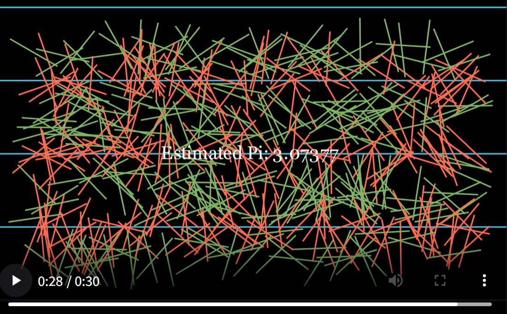

# Buffon's Needle 投针实验

计算物理的一次大作业，也是蒙特卡洛算法的一次最早引入，在这里做一个例子测试一下 GitHub 功能。  
项目是基于 **manim** 库写的一个演示投针算法的动画，manim 库是 3blue1brown 开发的数学物理视频库，本代码旨在一次学习。  

---

## 数学原理

该实验方案的原理是基于数学统计理论所得的结论，即在实验中细针与平行线（此时是假设针与线宽相同）相交的概率为：  

$$
P = \frac{2}{\pi}
$$


设针与平行线的垂直方向的夹角为 $\alpha$，那么针在垂直方向上的投影长度为：  

$$
l \cdot |\cos \alpha|
$$

若平行线间距为 $s$，则针与平行线相交的概率为：  

$$
\frac{l \cdot |\cos \alpha|}{s}
$$

由于 $\alpha$ 在区间 $[0, \pi]$ 内均匀分布，所以 $|\cos \alpha|$ 的平均值为：  

$$
\frac{1}{\pi} \int_0^\pi |\cos \alpha| \, d\alpha = \frac{2}{\pi} 
$$

---

假如在 $N$ 次投针实验中，有 $M$ 次与平行线相交。  

当 $N$ 充分大时，相交的频率 $\tfrac{M}{N}$ 就近似为针与平行线相交的概率。  

因此结合公式，可得：  

$$
\pi \approx \frac{2N}{M}
$$

---

## 效果展示

### 动画截图


---

## 项目结构
安装manim库同时输出视频
```bash
manim -p -ql drop_needles.py BuffonNeedleFast   # 进入相应文件夹运行


python drop_the_needle.py   #进行数值模拟计算

